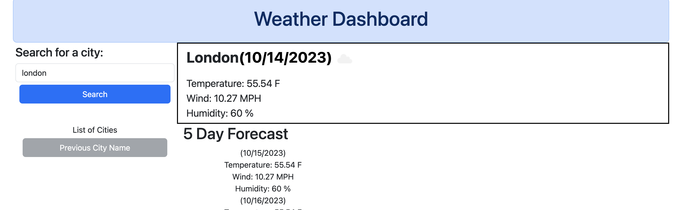

# weather-forecast-dashboard

## project description

This project involves creating a forecast page for a specific city. The user types in the city on the left hand side of the page - it will populate with weather of the current day and a five day forecast. Each weather section includes temperature, wind, humidity, an icon, and date. It is styled in a responsive, easy to use manner.

This project utilizes APIs, bootstrap, dayjs for technical components.

A way to improve this project would include adding a cam view of a current location in the city to display weather (similiar to TV news weather reports).
## usage
Screenshot:

Deployment Link:https://github.com/lavollmer/weather-forecast-dashboard
## credits
The project was done in conjunction with the U of MN bootcamp and tutoring services.
## license
MIT license